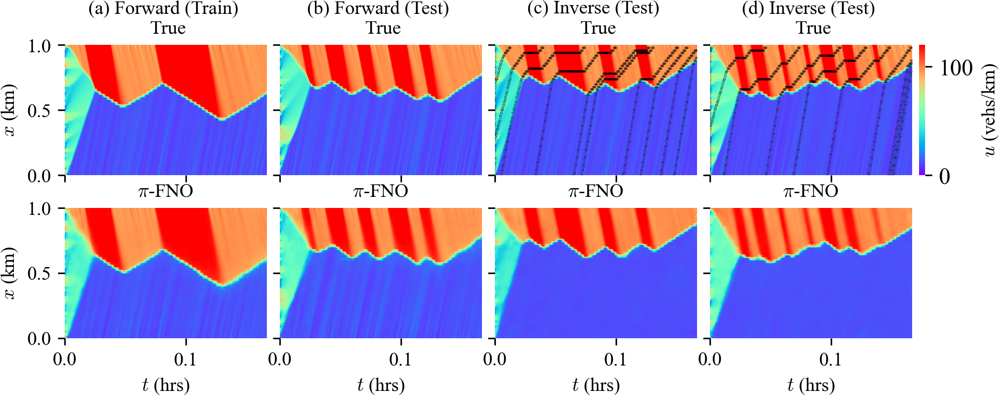

# Physics Informed Fourier Neural Operator $\pi$-FNO

Physics Informed Fourier Neural Operator ($\pi$ -FNO) is a physics-informed variant of regular FNO model, trained using physics constrained loss function. We show that ($\pi$ -FNO) can learn the weak solutions of nonlinear hyperbolic partial differential equations. A sample result is shown below. More details will be uploaded soon.

